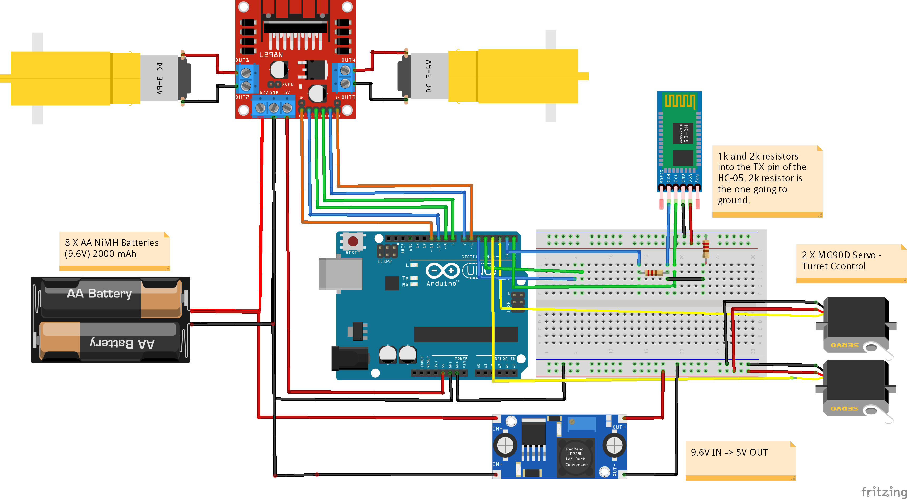

# KV-1 Arduino Tank

An **Arduino-powered remote-controlled tank**, modeled after the Soviet **KV-1 heavy tank**. This tank features **turret rotation, barrel elevation, motorized tracks**, and **Bluetooth control** using an HC-05 module.

## Features
- **Turret rotation** (Servo-controlled)
- **Gun elevation control** (Servo-controlled)
- **Dual motor drive system** (L298N Motor Driver)
- **Bluetooth control via mobile app or PC**
- **Modeled after the KV-1 heavy tank**
- **Custom 3D-printed/designable chassis**

## Parts List

| Component                    | Quantity | Notes                           |
|------------------------------|----------|---------------------------------|
| Arduino (Uno/Nano)            | 1        | Main controller                 |
| HC-05 Bluetooth Module        | 1        | Wireless control                |
| L298N Motor Driver           | 1        | Controls dual motors            |
| DC Motors                     | 2        | Track movement                  |
| MG90D Servos | 2        | Turret control |
| 9.6V 2000mAh Battery Pack    | 1        | Power supply                    |
| Jumper Wires                 | -        | Various connections             |
| Custom Tank Chassis          | 1        | 3D printed or custom-built      |
| Custom Firing Mechanism (Optional) | 1        | Mechanical |

## Wiring Diagram

## Controls (Bluetooth Commands)
Format: Magnitude, Angle, Left, Right, Fire
Where:\n
Magnitude is an integer
Angle is an integer
Left, Right and Fire are boolean values (0, 1)

## Installation & Setup
1. **Assemble the tank** by wiring the motors, servos, and HC-05 module to the Arduino.
2. **Upload the Arduino code** to your board.
3. **Pair Bluetooth (HC-05)** with your mobile device.
4. **Use a serial Bluetooth app** to send movement commands.

